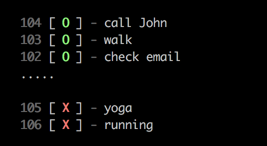

# Td - Command line todo list manager.

Manage your tasks with ease.



### Usage

```
Usage:
  => td [options] [args...]

Options:
  -l       List all items
  -a       Add an item           [string]
  -d       Delete an item by id  [string]
  -f       Finish an item by id  [string]
  -r       Redo an item by id    [string]
  -v       Print current version
  --clear  Clear all items
```

---

#### License: MIT

#### Author: [cyyyu](https://github.com/cyyyu)

